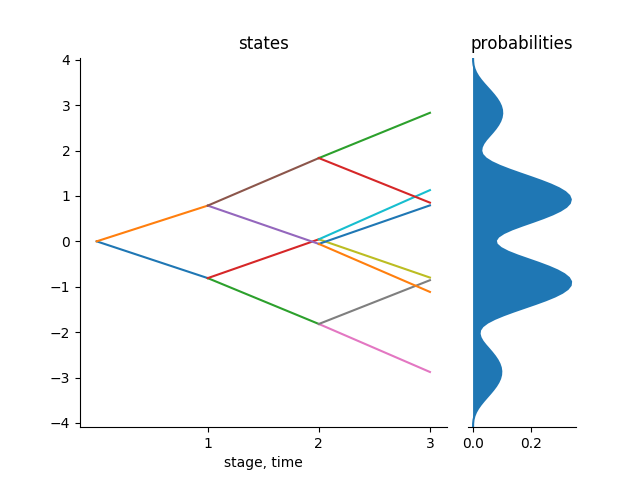
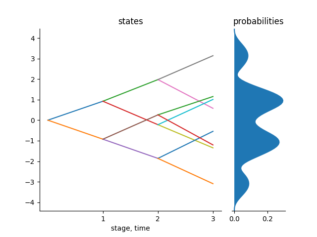
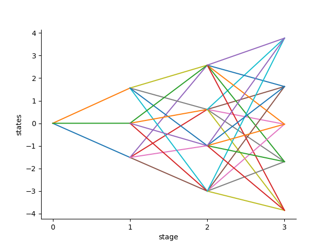

<a name="logo"/>
<div align="center">
</img>
</a>
</div>

| **Build and Test Status**         | **Coverage**                          | **Documentation**             |
|:---------------------------------:|:-------------------------------------:|:-----------------------------:|
|[](https://travis-ci.com/kirui93/ScenTrees.jl) | [](https://codecov.io/gh/kirui93/ScenTrees.jl) | [](https://kirui93.github.io/ScenTrees.jl/latest/)|

# ScenTrees.jl

`ScenTrees.jl` is a Julia package for generating and improving scenario trees and scenario lattices for multistage stochastic optimization problems using _stochastic approximation_. It is totally written in the Julia programming language. This package provides functions for generating scenario trees and scenario lattices from stochastic processes and stochastic data.

We provide two important features at the moment:

- Generation of scenario trees and scenario lattices using stochastic approximation procedure.
    + Scenario trees are used in the case of discrete time and discrete state stochastic processes.
    + Scenario lattices are a natural discretization of Markov processes and so if the stochastic process is Markovian, scenario lattices would approximate the process well.
- Estimating trajectories from stochastic data using conditional density estimation.
    + This is a non-parametric technique for generating trajectories from a given observed data whose distribution is unknown.
    + The new trajectories estimated here can thus be used in stochastic approximation process to generate scenario trees and scenario lattices.

Stochastic approximation procedure in `ScenTrees.jl` library follows from the framework provided by [Pflug and Pichler(2015)](https://doi.org/10.1007/s10589-015-9758-0). The two main user inputs are a fixed branching structure and a function that generates samples from a stochastic process.

*N/B* - _This package is actively developed and therefore new improvements and new features are continuously added._

## Installation

Get the latest stable release with Julia's package manager:

```julia
] add ScenTrees
```

To use `ScenTrees.jl`, you need to have Julia >= v1.0. This package was developed in Julia 1.0.4, and has been tested for Julia >= v1.0 in Linux and OSX distributions.

## Documentation

To access the documentation just click on this [link](https://kirui93.github.io/ScenTrees.jl/latest/). Here you can get the description of the various functions in the package and also different examples for the different features.

## Example of Usage

After installing the ScenTrees.jl package, you can use it as in the following examples:

1. Consider the Gaussian random walk process in 4 stages. This process is already available in the package and can just be called by `gaussian_path1D()` for 1D and `gaussian_path2D()` for 2D. We want to approximate 1D process with a scenario tree as follows:

```julia
julia> using ScenTrees
julia> gstree = tree_approximation!(Tree([1,2,2,2],1),gaussian_path1D,100000,2,2);
julia> tree_plot(gstree)
```


2. We want to approximate running maximum process with a scenario lattice. It follows the same procedure as for scenario trees only that we use a different function as follows:

```julia
julia> using ScenTrees
julia> rmlattice = lattice_approximation([1,2,3,4],running_maximum1D,100000);
julia> plot_lattice(rmlattice)
```


3. We also provide the conditional density estimation of trajectories given data. Given an `NxT` dataframe, we use the `kernel_scenarios()` function to generate a new and similar trajectory with length equal to `T`. This function can thus be used to generated trajectories for creating a scenario tree and a scenario lattice. Consider a Gaussian random walk data which can be generated by calling the function `gaussian_path1D()` many times and saving the result in a matrix form. We can use this data and the kernel density estimation method to generate new and similar trajectories as follows:

```julia
julia> using ScenTrees
julia> using Distributions
julia> gsdata = Array{Float64}(undef,1000,4)
julia> for i = 1:1000
           gsdata[i,:] = gaussian_path1D()
       end
julia> gsGen = kernel_scenarios(gsdata,Logistic; Markovian = true)()
4-element Array{Float64,1}:
 6.3183e-16
-1.8681
-3.7719
-3.5241
```

To use the above samples for scenario trees or scenario lattice generation:

```julia
julia> kerneltree = tree_approximation!(Tree([1,2,2,2],1),kernel_scenarios(gsdata,Logistic;Markovian=false),100000,2,2);
julia> tree_plot(kerneltree)
julia> kernelLattice = lattice_approximation([1,3,4,5],kernel_scenarios(gsdata,Logistic;Markovian=true),100000,2);
julia> plot_lattice(kernelLattice)
```

| [](docs/src/assets/kerneltree.png)  | [](docs/src/assets/kernelLattice.png) |
|:---:|:---:|
|Kernel Scenario Tree | Kernel Scenario Lattice  |

## Contributing to ScenTrees.jl

As in [CONTRIBUTING.md](https://github.com/kirui93/ScenTrees.jl/blob/master/CONTRIBUTING.md), if you believe that you have found any bugs or if you need help or any questions regarding the library and any suggestions, please feel free to file a [new Github issue](https://github.com/kirui93/ScenTrees.jl/issues/new). You can also raise an issue or a pull request which fixes the issue as long as it doesn't affect performance.

## Citing ScenTrees.jl
To be added.

## References

+ Pflug, Georg Ch., and Alois Pichler, 2012. *A distance for Multistage Stochastic Optimization Models*. SIAM Journal on Optimization 22(1) Doi: https://doi.org/10.1137/110825054

+ Pflug, Georg Ch., and Alois Pichler,2015. *Dynamic Generation of Scenario Trees*. Computational Optimizatio and Applications 62(3): Doi: https://doi.org/10.1007/s10589-015-9758-0

+ Pflug, Georg Ch., and Alois Pichler,2016. *From Empirical Observations to Tree Models for Stochastic Optimization : Convergence Properties : Convergence of the Smoothed Empirical Process in Nested Distnce.* SIAM Journal on Optimization 26(3). Society for Industrial and Applied Mathematics (SIAM). Doi: https://doi.org/10.1137/15M1043376.
