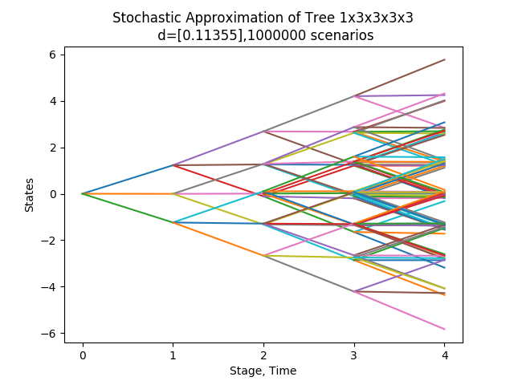

# ScenTrees.jl

`ScenTrees.jl` is a package for generating and improving scenario trees and scenario lattices for multistage stochastic optimization problems using _stochastic approximation_. The documentation can be found https://kirui93.github.io/ScenTrees.jl/latest/.

The `ScenTrees` library follows the stochastic approximation framework provided by [Pflug and Pichler(2015)](https://doi.org/10.1007/s10589-015-9758-0). This package is actively developed and new features are continuously added.

The following shows an example of approximating a Gaussian random walk process using a scenario tree with 1x3x3x3x3 branching structure and 1-dimensional state space of the nodes in the scenario tree. The scenario tree on the right approximates the Gaussian random walk on the left. The multistage distance between the two stochastic processes is `0.1138`; the lower the multistage distance between the two stochastic processes, the better the scenario tree or the scenario lattice approximates the stochastic process.

  
   

If you need help or any questions regarding the library and any suggestions, file a Github issue on https://github.com/kirui93/ScenTrees.jl/issues/new.
