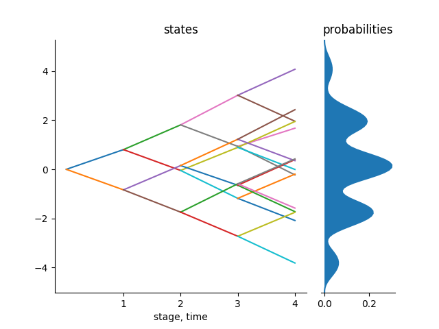

```@meta
CurrentModule = ScenTrees
```

# Introduction

In multistage stochastic optimization, we are interested in approximations of  stochastic processes in by a finite structures. These processes are random and they have uncertain scenarios and a decision maker needs to make decisions at different stages. It is useful to depict the possible sequences of data for this processes in form of a `scenario tree` in the case of a discrete time stochastic process and a `scenario lattice` for Markovian data processes.

A scenario tree/lattice is organized in levels which corresponds to stages ``1,\ldots,T``. Each node in a stage has a specified number of predecessors as defined by the branching structure.

## Goal

The goal  of `ScenTrees.jl` is to generate a valuated probability tree or a lattice which represents the stochastic process in the best way possible. 

For example, consider a Gaussian random walk in 5 stages. The starting value of this process is known and fixed, say at ``0`` and the other values are random. The following plot shows 10,000 sample paths of this process:


Using those paths, we generate and improve a scenario tree or a scenario lattice. The number of iterations for the algorithm equals the number of sample paths that we want to generate from the stochastic process and the number of stages in the stochastic process equals the number of stages in the scenario tree or the scenario lattice. There are a lot of different branching structures that the user can choose for a tree that represents this stochastic process. The branching structure shows how many branches each node in the tree has at each stage of the tree. For example, we can use a branching structure of ``1x2x2x2x2`` for the scenario tree. This means that each node in the tree has two children. Basically, this is a `binary tree`. Using this branching structure, we obtain the following valuated probability tree that represents the above stochastic process:



The above tree is optimal and therefore can be used by a decision maker for a decision making process depending on the type of problem he/she is handling.

To measure the quality of the approximation, we use the concept of multistage distance between the stochastic process and the scanario tree or lattice.

### Multistage distance

To measure the distance of stochastic processes, it is not sufficient to only consider the distance between thier laws. It is also important to consider the information accumulated over time i.e., what the filtrations has to tell us over time. The Wasserstein distance do not correctly separate stochastic processes having different filtrations. It ignores filtrations and hence does not distinguish stochastic processes.

Multistage distance was introduced by [Prof. George Pflug (2009)](https://doi.org/10.1137/080718401) . It turns out that this distance is very important to measure the distence between multistage stochastic processes as it incorporates filtrations introduced by the processes. We use this distance in our algorithm to measure the quality of approximation of the scenario tree. Generally, a scenario tree with a minimal distance to the stochastic process is consider to have a better quality approximation.

## Description of a scenario tree

A scenario tree is described by the following:

1. Name of the tree
2. Parents of the nodes in the tree
3. Children of the parents in the tree 
4. States of the nodes in the tree
5. Probabilities of transition from one node to another.

## Description of a scenario lattice

A scenario lattice differs from a scenario tree in that every node in stage `t` is a child for each node in stage `t-1`. So the nodes in stage `t-1` share the same children.

Due to the above, we only describe a scenario lattice by:

1. Name of the lattice
2. States of the nodes of the lattice
3. Probabilities of transition from one node to another in the lattice

## Usage

Since we have the basics of the scenario tree and the scenario lattice and since we created `ScenTrees.jl` 
with an intention of being user-friendly, we will give an example of its usage and explain each part of it. 
In the module of `ScenTrees.jl`, we have all the exported functions that are visible to the user i.e, that are public, and the user can call these functions depending on what he/she wants to achieve with this library

```julia
module ScenTrees
  include("TreeStructure.jl")
  include("TreeApprox.jl")
  include("StochPaths.jl")
  include("LatticeApprox.jl")
  export TreeApproximation!, LatticeApproximation, Tree, nodes, stage, height, leaves,
        root,partTree, buildProb!, treeplot, plotD, PlotLattice,
        GaussianSamplePath,RunningMaximum
  ........
end
```

All of the above functions have been documented in their respective scripts and the user can find out what each function does by putting a `?` before the function. For example, `?leaves` will give an explanation of what the function `leaves` does. 

In the tutorials to come, we will have a look in detail on the functionalities of the main functions of this library.