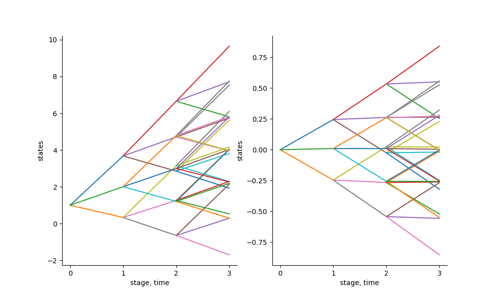

```@meta
CurrentModule = ScenTrees
```

# Stochastic Approximation Process

This package was made for this purpose. Given a stochastic process, we want to approximate the process using either a scenario tree or a scenario lattice.

Every stochastic approximation iteration modifies one path within the tree towards the new sequence. In this way the approximating quality of the tree is improved each time a new sample is observed. The tree is not stable in the beginning but with more and more iterations, the scenario tree converges in probability. The resulting tree can be used for decision making process.

The stochastic approximation process is outlined as follows:

1. Decide on the branching structure of the tree/ lattice,

2. Start with a tree/lattice (which is more of a qualified guess) with the stated branching structure,

3. Generate one sample from a particular known distribution with the same length and dimension as the states of the nodes of the tree/lattice.

4. The algorithm finds a sequence of nodes in the tree where the distance between the states of those nodes and the generated sample is minimal. The algorithm then updates the states of those nodes with the values in the generated sample. The states of other nodes remains unchanged.

5. At every iteration of the algorithm, the multistage distance is calculated.

6. When done with the states of the nodes of the tree, the algorithm calculates the conditional probabilities to reach each node in the tree. At the end, the sum of the conditional probabilities to reach each node of the same parent must add up to 1.

7. The algorithm stops when all the number of iterations have been performed.

!!! tip
    The most important function in this approximation process is the function that user wants to approximate. This is the function that generates samples that improves the tree in each iteration. _The function must take the number of stages and the dimension as inputs._

## Tree Approximation

In this package, we have the function `TreeApproximation!` which does the stochastic approximation process for scenario trees. This function takes the following inputs:

  - Tree (which takes the branching structure and dimension and inputs)

  - Name of the function that generates samples

  - Number of iterations

  - Value `d` for distance (2 is the default for we use the Euclidean distance, 1 would be for the normal distance)

  - Value `r` for the Wasserstein distance (2 is the default for Wasserstein distance)

Given the following inputs, the function does the stochastic approximation process and returns a valuated scenario tree.

!!! info
    The user must provide the above inputs to the function. The user also dictates where the tree starts from in the script that generates samples from a stochastic process that the user wants to approximate.

### Example

Consider the following. We want to approximate the Gaussian random walk in 5 stages with a tree with a branching structure of `1x3x3x3x3` using the usual Euclidean distance and `r=2` for the Wasserstein distance.

```julia
julia> using ScenTrees
julia> ex2 = Tree([1,3,3,3,3],1)
julia> sol1 = TreeApproximation!(ex2, GaussianSamplePath, 1000000, 2, 2)
julia> treeplot(sol1)
julia> savefig("treeapprox1.png")
```

The function `GaussianSamplePath` takes the number of stages and the dimension as depicted by the tree that you want to generate. For example, in the above, `GaussianSamplePath` function will take 5 as the number of stages and 1 as the dimension and then generate  5 samples of a Gaussian distribution.

The output for the above approximation, shown below, is a scenario tree that is stable and represents the stochastic process in the best possible way.


We can also appoximate a stochastic process in two dimension. Consider the Gaussian random walk in 2D. Our function `GaussianSamplePath` can generate samples from the Gaussian random walk in 2 dimension, for example as follows:

```julia
julia> GaussianSamplePath(4,2) # 4 stages, 2 dimension
3x2 Array{Float64,2}
1.0         0.0
-0.4368     -0.4629
2.3605      -0.2821
```

We can therefore do approximations in 2 dimension as follows:

```julia
julia> ex3 = Tree([1,3,3],2);
julia> sol2 = TreeApproximation!(ex3,GaussianSamplePath,1000000,2,2);
julia> plotD(sol2)
julia> savefig("treeapprox2D.png")
```



## Lattice Approximation

As mentioned before, some of the process that you may want to approximate are Markovian data processes. These processes can only be approximated by a scenario lattice. All the nodes in the same stage in a lattice have the same children nodes.

To approximate a Markovian data process, we use the function `LatticeApproximation`. This function takes the following inputs:

  - Branching structure,
  - Name of the function that generates samples and,
  - Number of iterations to be performed

Lattice Approximation follows the same stochastic approximation process as for the scenario tree. The only difference is that, in each stage of a lattice, we find the closest lattice entry and use the sample generated to improve it. At the beginning, the lattice is not stable but with more and more iterations, the scenario lattice converges in probability and the resulting lattice can then be used for decision making process.

All the probabilities in each stage of the lattice must sum up to 1.

### Example

Consider the following example. We want to approximate a Gaussian random walk of 12 stages with a scenario lattice with the branching structure of `1x3x4x5x6x7x8x9x10x11x12x13` and 1000000 iterations.

```julia
julia> sol4 = LatticeApproximation([1,3,4,5,6,7,8,9,10,11,12,13],GaussianSamplePath,1000000);
```
The result of the above approximation is a lattice which we can visualize it.

!!! info
    To visualize a scenario lattice, we use the `PlotLattice` function.

```julia
julia> PlotLattice(sol4)
julia> savefig("LatticeApprox.png")
```

The above approximation gives the following output:


You can see that in the scenario lattice, we have many possibilities than in a scenario tree. Hence, some people prefer a scenario lattice than a scenario tree.
