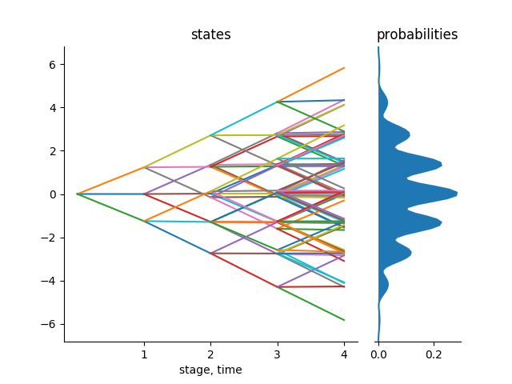
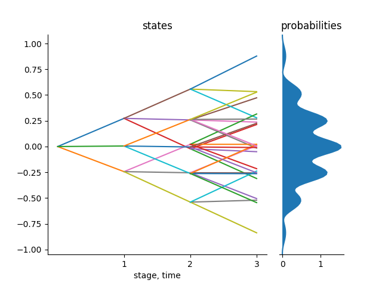
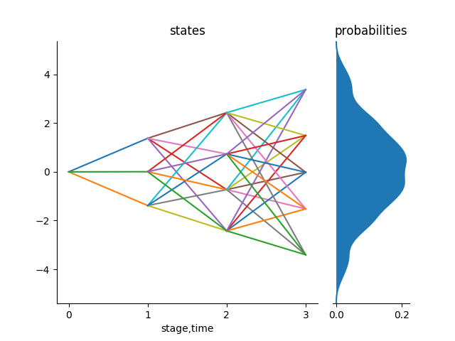

```@meta
CurrentModule = ScenTrees
```

# Stochastic approximation process

This package follows the stochastic approximation procedure and theory in [Pflug and Pichler (2015)](https://doi.org/10.1007/s10589-015-9758-0). Given a stochastic process, we want to approximate the process using either a scenario tree or a scenario lattice.

Every stochastic approximation iteration modifies one path within the tree towards the new sequence. In this way the approximating quality of the tree is improved each time a new sample is observed. The tree is not stable in the beginning but with more and more iterations, the scenario tree converges in probability. The resulting tree can be used for decision making process.

The stochastic approximation process is outlined as follows:

1. Decide on the branching structure of the tree/ lattice,
2. Start with a tree/lattice (which is more of a qualified guess) with the stated branching structure,
3. Generate one sample from a particular known distribution with the same length and dimension as the states of the nodes of the tree/lattice.
4. The algorithm finds a sequence of nodes in the tree where the distance between the states of those nodes and the generated sample is minimal. The algorithm then updates the states of those nodes with the values in the generated sample. The states of other nodes remains unchanged.
5. At every iteration of the algorithm, the multistage distance is calculated.
6. When done with the states of the nodes of the tree, the algorithm calculates the conditional probabilities to reach each node in the tree. At the end, the sum of the conditional probabilities to reach each node of the same parent must add up to 1.
7. The algorithm stops when all the number of iterations have been performed.


The most important function in this approximation process is the function that user wants to approximate. This is the function that generates samples that improves the tree in each iteration. _The function must be designed in a way that it doesn't take any inputs. It must be a hard-coded function in that and the length of an array that it produces must match the number of stages of the tree and the dimension of the states of the tree._

!!! tip
    The branching structure of the scenario tree and the scenario lattice must start with `1`. This indicates the root of the tree. It also fix the deterministic state of the tree. The rest of the values in the branching vector of the scenario tree or the scenario lattice generally depends on the user. For example, a binary tree in 4 stages would have a branching structure of `[1,2,2,2]`.

## Tree Approximation

In this package, we have the function `tree_approximation!(Tree(bstructure, dimension), path, nIterations, p = 2, r = 2)` which does the stochastic approximation process for scenario trees. This function takes the following inputs:

- Tree (which takes the branching structure and dimension and inputs)
- Name of the function that generates samples from a stochastic process you want to approximate
- Number of iterations
- Choice `d` of the norm (Example: `max = 0,sum = 1,Euclidean = 2`(default))
- Choice `r` for the multistage distance (`r = 2`(default))

Given the above inputs, the function does the stochastic approximation process and returns a valuated scenario tree.

!!! info
    The user must provide the above inputs to the function. The user also dictates where the tree starts from in the script that generates samples from a stochastic process that the user wants to approximate.

### Example

Consider the following. We want to approximate the Gaussian random walk in 4 stages with a tree with a branching structure of `1x3x3x3` in 1 dimension using the usual Euclidean distance ,`p=2` and `r=2` for the multistage distance.

```julia
julia> using ScenTrees
julia> ex2 = Tree([1,3,3,3],1)
julia> sol1 = tree_approximation!(ex2, gaussian_path1D, 100000, 2, 2)
julia> tree_plot(sol1)
julia> savefig("treeapprox1.png")
```

The function `gaussian_path1D()` takes no inputs and generates one trajectory of the Gaussian random walk in 4 stages. For each iteration of the process, this process function generates a trajectory that will help improve the states of the nodes in the scenario tree.
```julia
julia> gaussian_path1D()   # 4 stages, 1 dimension
[0.0, 1.49765, -0.17537, -1.2982]
```
The output for the above approximation, shown below, is a scenario tree that is stable and represents the stochastic process in the best possible way.



We can also approximate a stochastic process in two dimension. Consider the Gaussian random walk in 2D. Our function `gaussian_path2D` can generate samples from the Gaussian random walk in 2 dimension, for example as follows:

```julia
julia> gaussian_path2D() # 4 stages, 2 dimension
[1.0000, 0.76636, 3.65296, 5.1779; 0.0000, -0.44216, -0.14275, -0.42350]
```

We can therefore approximate a scenario tree in 2 dimension as follows:

```julia
julia> ex3 = Tree([1,3,3,3],2);
julia> sol2 = tree_pproximation!(ex3, gaussian_path2D, 1000000, 2, 2);
julia> trees = part_tree(sol2)
julia> tree_plot(trees[1])
julia> savefig("trees1.png")
julia> tree_plot(trees[2])
julia> savefig("trees2.png")
```
Each of these scenario trees have a multistage distance of `0.25142` from the original stochastic process.

|[](../assets/trees1.png)| [](../assets/trees2.png) |
|:-----------:|:--------------:|
| Tree for state 1 | Tree for state 2 |

## Lattice Approximation

As mentioned before, some of the process that you may want to approximate are Markovian data processes. These processes can only be approximated by a scenario lattice. All the nodes in the same stage in a lattice have the same children nodes.

To approximate a Markovian data process, we use the function `lattice_approximation(bstructure, path, nIterations, r = 2)`. The following are the description of the inputs of the function:

- Branching structure of the scenario lattice,
- Function that generates samples from the stochastic process you want to approximate and,
- Number of iterations to be performed, and,
- Multistage parameter, `r` ( default, `r = 2`)

Lattice Approximation follows the same stochastic approximation process as for the scenario tree. The only difference is that, in each stage of a lattice, we find the closest lattice entry and use the sample generated to improve it. At the beginning, the lattice is not stable but with more and more iterations, the scenario lattice converges in probability and the resulting lattice can then be used for decision making process.

All the probabilities in each stage of the lattice must sum up to 1.

### Example

Consider the following example. We want to approximate a Gaussian random walk of 4 stages in one dimension with a scenario lattice with the branching structure of `1x3x4x5` and 1,000,000 iterations.

```julia
julia> sol4 = lattice_approximation([1,3,4,5], gaussian_path1D, 1000000, 2 );
```
The result of the above approximation is a scenario lattice which represents the stochastic process in the best way. The distance between the scenario tree and the original process is `0.8388`. This scenario lattice can thus be used for decision making process under uncertainty.

Notice that the sum of probabilities of the scenario lattice at each stage is equal to 1.
```julia
julia> sum.(sol4.probability)
[1.0, 1.0, 0.999999999, 1.0]
```

!!! info
    To visualize a scenario lattice, we use the `plot_lattice` function.

```julia
julia> plot_lattice(sol4)
julia> savefig("LatticeApprox.png")
```

The above approximation gives the following output:



You can see that in the scenario lattice, we have many possibilities than in a scenario tree. This shows generally that scenario lattices with half the number of nodes of a scenario tree have more number of scenarios or trajectories. A scenario lattice does not allow to trace back the history of a given scenario based on its ending node as there are many possible paths at that node. This is the main reason why we consider scenario lattices for Markovian processes
