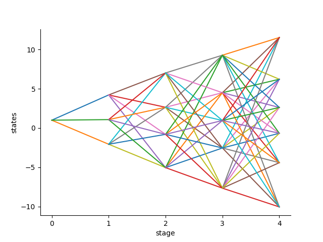

```@meta
CurrentModule = ScenTrees
```

# Kernel Density Estimation

This is a non-parametric technique for generating trajectories used to generate and improve scenario trees and scenario lattices in the stochastic approximation algorithm already discussed in the previous tutorials. This is a case where the distributions are not available explicitly and so the samples can be drawn from a data by proper approximations. Generating a scenario tree/lattice using trajectories from these method involves two steps:

1. Conditional density estimation process, and,
2. Stochastic approximation process.

The stochastic approximation process has already been described in the previous tutorials. Hence, here we will concentrate on the conditional density estimation process.

The conditional density estimation step involves two steps:

1. Estimation of the distribution of conditional densities, and,
2. Composition method

We estimate the distribution of transition densities given the history of the process. This distribution is estimated by the non-parametric kernel density estimation. The density at stage ``t+1`` conditional on the history ``\mathbf{x_{t}} = (x_1,x_2,\ldots,x_t)`` is estimated by
```math
\hat{f}_{t+1}(x_{t+1}|\mathbf{x_{t}}) = \sum_{j=1}^{N} w_j(\mathbf{x_{t}}) \cdot k_{h_N}(x_{t+1} - \xi_{j,t+1}),
```
where ``k(.)`` is a kernel function, ``h_N`` is the bandwidth and ``k_{h_N}`` is the weighted kernel function.

The weights are given by
```math
w_j(\mathbf{x_{t}}) = \frac{k\big(\frac{x_{i_1} - \xi_{j,1}}{h_N}\big)\cdot \ldots \cdot k\big(\frac{x_{i_t} - \xi_{j,t}}{h_N}\big)}{\sum_{\ell=1}^{N}k\big(\frac{x_{i_1} - \xi_{l,1}}{h_N}\big)\cdot \ldots \cdot k\big(\frac{x_{i_t} - \xi_{l,t}}{h_N}\big)}.
```
Notice from above that the weights depend on the history ``\mathbf{x_{t}}`` up to stage ``t`` only. Also, the weights sum up to 1 for every ``\mathbf{x_{t}}$, i.e., $\sum_{j=1}^{N} w_j(\mathbf{x_{t}}) = 1``.

We use the composition method to find the samples from the conditional distribution ``\hat{f}_{t+1}(.|\mathbf{x_{t}})`` as follows. Pick a random number ``u \in (0,1)`` where ``u`` is uniformly distributed then find a summation index $j^{\star} \in {1,2,\ldots,N}$ such that
``\sum_{j=1}^{j^{\star}-1} w_j(\mathbf{x_{t}}) < U \leq \sum_{j=1}^{j^{\star}} w_j(\mathbf{x_{t}}).``

It has been shown that the cumulative sum of weights leads to a high probability of picking a data path near the observation.

The value of the data ``\xi_t`` is obtained by setting the value at stage ``t`` to
```math
\xi_t = X_{j^{\star}} + h_N \times \text{rand}(k())
```
where ``\text{rand}(k())`` is a random value sampled from the kernel estimator.

The generated data point is according to the distribution of the density at the current stage and dependent on the history of all the data points. It has been shown that the choice of the kernel does not have an important effect on density estimation. Hence, we employ the following logistic kernel as default: ``k(x) = \frac{1}{(e^x + e^{-x})^2}.``

One of the most important factor to consider in density estimation is the bandwidth. We use the Silverman's rule of thumb to obtain the bandwidths for each of the data columns as follows ``h_N = \sigma(X_t)\cdot N^{\frac{-1}{d+4}}``
where ``d`` is dimension of values sitting on each node at stage ``t`` and ``\sigma(X_t)`` is the standard deviation of data in stage ``t``.

Using the above procedure, every new sample path starts with ``x_1`` at the first stage. Using the composition method, we find a new sample ``x_2`` from ``\hat{f}_2(.|x_1)`` at the second stage. Next, we generate a new data point ``x_3`` from ``\hat{f}_3(.|x_{1:2})``  at the third stage, a new sample ``x_t`` from ``\hat{f}_t(.|x_{1:t-1})`` at stage ``t`` e.t.c. Iterating the procedure until the stage ``T`` reveals a new sample path ``x = (x_1,x_2,\ldots,x_T)``, generated from the initial data ``\xi_1,\ldots,\xi_N`` directly.

The new sample path ``x`` is what we will feed in the stochastic approximation algorithm to generate either a scenario tree or a scenario lattice.

## Implementation of the above process

We use the concept of function closures to implement the above process. The motive to use function closures is because we want to follow the guidelines of the package where the process function should be coded in such a way that it doesn't take any inputs. We assume that the user of this package is conversant with function closures. The user is required to provide a data in 2 dimension, i.e., a matrix of `Float64` or `Int64`, to this function and also the distribution of the kernel that he/she wants to use. The default kernel distribution is the Logistic kernel. The kernel distribution should conform to the distributions stated in [Distributions.jl](https://github.com/JuliaStats/Distributions.jl) package.

Most of the times when you load the data into Julia, it loads it as a `DataFrame` type. But we have wrote the function in a manner that the user should provide a Matrix of either floats or integers. In the following procedure, we use the function `Matrix` to convert the loaded dataframe into a matrix which is the right type of input into the function.

The function `kernel_scenarios(data::Union{Array{Int64,2},Array{Float64,2}}, kernelDistribution = Logistic; Markovian = true)` takes a ``(N \times T)`` dimensional data and the distribution of the kernel you want to employ. The $N$ rows of the data are the number of trajectories in the initial data and the $T$ columns is the number of stages in in each trajectory of the data. We also let the user to specify whether the process he/she is creating is a Markovian process or not. We are aware that scenario lattices are natural discretization of Markovian process. Hence the user should create samples for a scenario tree for the condition `Markovian = false` and scenario lattices for the condition `Markovian = true`.

Since `tree_approximation!` and `lattice_approximation` function needs a process function for generating samples that doesn't take any inputs, we employ the concept of function closures inside the above function. The function `kernel_scenarios(data, kernelDistribution; Markovian = true)` is a get-field type of a function closure and so is sufficient to be a function required for stochastic approximation process.

To confirm the above statement, consider a ``1000 \times 5`` dimensional data from random walk. What is important to be said is that we use the package [`CSV`.jl](https://github.com/JuliaData/CSV.jl) to read the data into Julia and since we need the data in matrix form, we use the function `Matrix` from the package [`DataFrames.jl`](https://github.com/JuliaData/DataFrames.jl) to convert the dataframe into an array in two dimension which is then the input of our function.

```julia
julia> using ScenTrees, CSV, Distributions
julia> data = CSV.read(".../RandomDataWalk.csv")
julia> Rdw = Matrix(data)
julia> Kdt = kernel_scenarios(Rwd,Logistic;Markovian=true)
(::getfield(ScenTrees,Symbol("#closure#52")){Array{Float64,2},
Int64,Int64,Array{Float64,1},Array{Float64,1},Array{Float64,1}})
(generic function with 1 method)
julia> ExampleTraj = kernel_scenarios(Rwd, Logistic; Markovian = true)()
[2.9313, -2.0964, 3.7671, 2.1476, 0.9424]
```
As in `ExampleTraj` above, this function returns is a new sample according to the distribution of the density at the current stage and dependent on the history of all the data points.

We use the above data to approximate a scenario lattice in `5` stages with a branching structure of ``(1\times 3\times 4\times 5\times6)``  and ``100,000`` number of iterations as follows:

### Approximating with a scenario lattice

Using the above data, the conditional density estimation method and lattice approximation process we can generate a scenario lattice with a branching structure `[1,3,4,5,6]` and `100,000` iterations as follows.

```julia
julia> KernExample = lattice_approximation([1,3,4,5,6],
kernel_scenarios(Rwd, Logistic; Markovian = true), 100000, 2);
julia> plot_lattice(KernExample)
```
The following is the resultant lattice from the above approximation. The algorithm returns the multistage distance of the scenario lattice as `dist = 1.1718`.



### Approximating with a scenario tree

Using the same procedure, we can generate a binary scenario tree with `100,000` iterations as follows.

```julia
julia> KernTree = tree_approximation!(Tree([1,2,2,2],1),
kernel_scenarios(gsdata, Logistic; Markovian = false), 100000, 2, 2);
julia> tree_plot(KernTree)
```
The following figure shows the resultant scenario tree. The algorithm returns the multistage distance of the scenario lattice as `dist = 0.2753`.


This method is very efficient when you have limited data. This data may not be enough to generate a scenario tree or a scenario lattice. In case of limited data it is necessary to learn as much as possible from the observations available. Therefore generating scenarios using the above procedure proves to be important.
